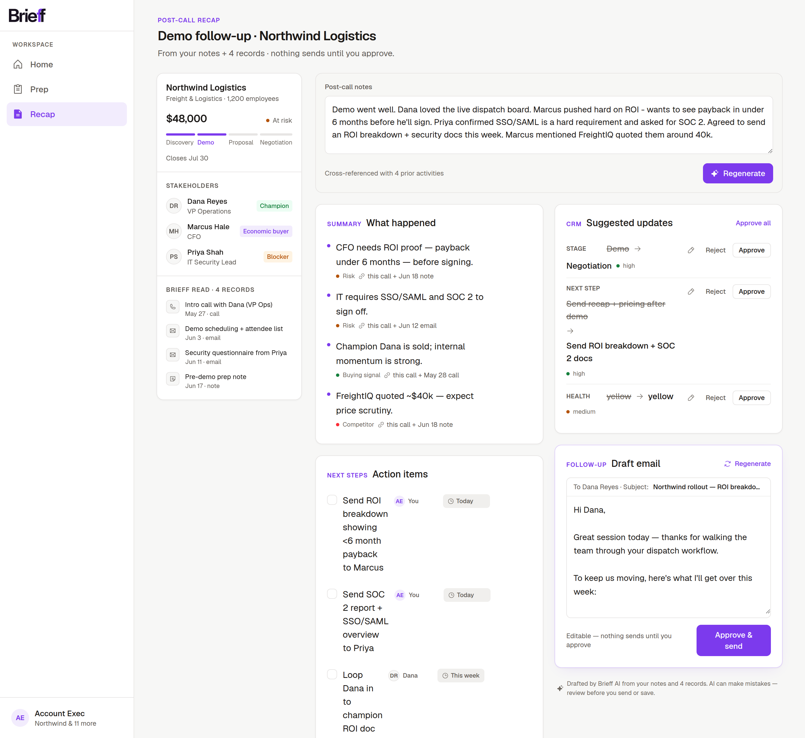
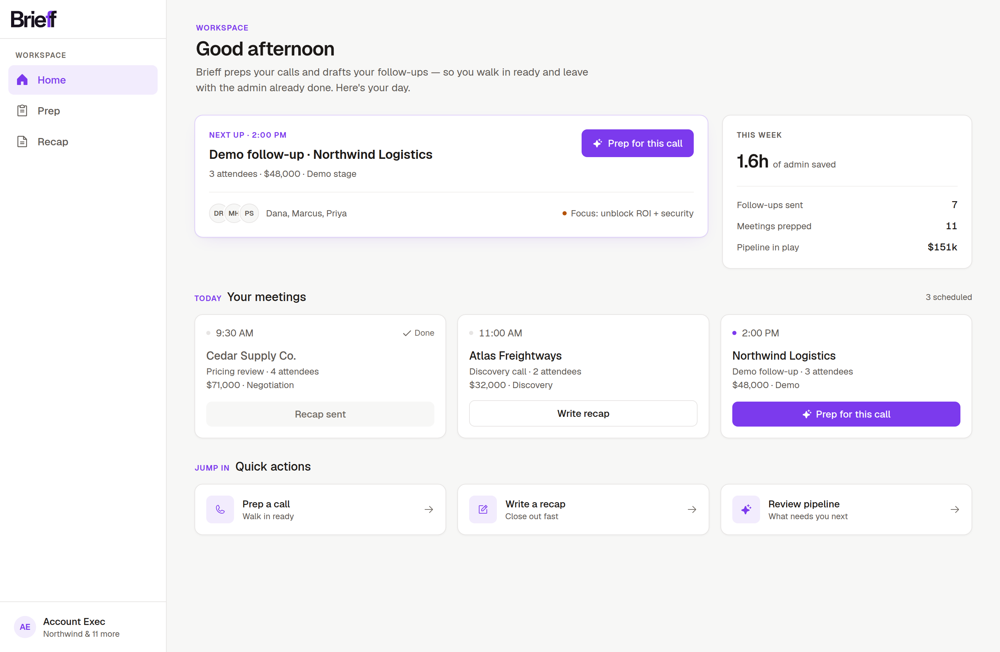
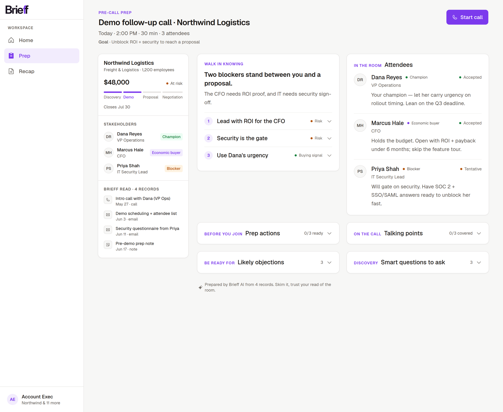
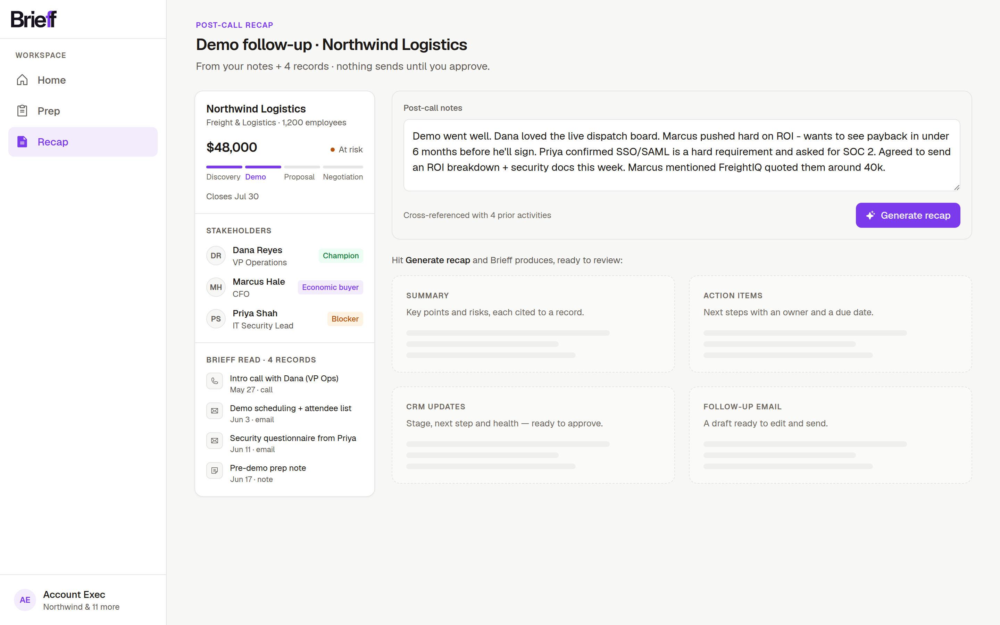
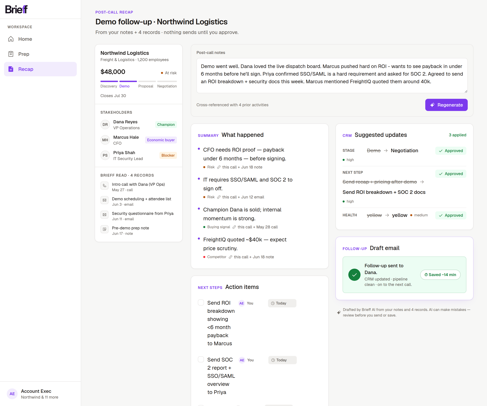

# Brieff — an AI sales copilot you don't have to babysit

**A meeting-prep and follow-up copilot for Account Executives — a working, deployed product with live AI, on seeded CRM data.**
Role: product design (strategy → IA → UI → brand → front-end build). Type: self-directed, shipped live.
**Try it:** [brieff-alpha.vercel.app](https://brieff-alpha.vercel.app)

---

## TL;DR

Sales reps lose 1–2 hours a day to call prep and CRM admin, and they distrust AI that's slower, wrong,
or uncontrollable. **Brieff** is a copilot scoped to one job — *walk in prepared, close out the admin
fast* — built around a single thesis: **review-and-approve, not chat**. Every claim cites its source
record, every output is an editable draft, and nothing is ever sent or written without the rep's
approval. I designed and built it as a working Next.js app with live AI generation, shipped it to production,
then took it through a full brand identity (naming, logo, color system, icons) end to end.

---

## 1. The problem

A mid-market B2B Account Executive runs 25–40 live opportunities and 5–8 calls a day. Between calls
they're reconstructing context ("who's on this call, what did we last say, what's at risk?") and after
calls they owe follow-up emails and CRM updates that pile up. That's the 1–2 hours/day that isn't
selling.

The trap most "AI for sales" tools fall into: they add an assistant that's *slower and less
trustworthy* than the rep's existing muscle memory. Real Salesforce-community pushback is blunt about
it — if the AI is slower, less accurate, or less controllable than search, reps route around it.

**So the design problem wasn't "add AI." It was: earn a skeptical power-user's trust on a narrow,
high-value job.**

## 2. The wedge

Not a general office assistant — an **AE copilot inside the CRM**, scoped to one loop: **prep before
the call, recap + follow-up after.** Narrow workflow, obvious business value, and a clear trust bar to
clear.

> **JTBD:** "When I've got a call coming up and a pile of follow-ups after, help me walk in prepared
> and close out the admin fast — *without babysitting the AI*."

**North-star metric:** active selling time reclaimed per rep per week (surfaced in-product as a
"Saved ~14 min" chip after each approved follow-up).

## 3. The four trust principles

Every decision had to honor these — they're the spine of the whole product:

- **Fast** — one step, no chat ping-pong. It must *beat* the rep's old shortcut, never be slower.
- **Transparent** — every AI claim cites its source record ("from the call on Jun 12").
- **Editable** — everything is a draft; the human approves before anything is written or sent.
- **Optional** — never blocks the rep's existing fast path. AI is a shortcut, not a tollbooth.

The biggest consequence of these principles was a thing I *didn't* build: **a chatbot.** Studying
M365 Copilot, I adopted its task-grade ideas (reassignable owner + due chips on actions, sales-signal
tags on summary bullets, a responsible-AI disclosure line) and deliberately **rejected its Q&A chat
panel** — a conversation surface violates "Fast" and invites the babysitting reps already distrust.

## 4. The core loop

Three screens, one workspace shell.

**Home** — the rep's day: next call, this-week stats, today's meetings as a card grid, quick actions.
A command center, not a cold open.

**Prep** — a read-optimized brief: "Walk in knowing" (one primary insight + three supporting leads
with the detail collapsed), attendees with roles, likely objections, and copyable discovery
questions. Posture is *skim and trust your read of the room.*

**Recap (the hero)** — paste rough notes once → a cited summary, owner-assigned action items, a
reviewable **CRM diff** (stage/next-step/health, each Approve/Reject), and a drafted follow-up email.
Approve & send → "Saved ~14 min." Transparency is made *spatial*: a sticky left rail shows exactly
which records the AI read ("Brieff read · 4 records") and every bullet links to its source.

## 5. Selected design decisions

### "The UI feels off" — the honest one
The first recap pass was a stack of identical white cards: monotone, low-density, and it read like a
*form*, not a workspace. I called it out, then fixed it research-first — locking references (Attio's
density, HubSpot/Gong's left context rail, Linear's section rhythm) and rebuilding into a **two-pane
layout**: a sticky context rail (deal-at-a-glance + stakeholders + the records the AI read = the
*Transparent* principle made physical) beside a denser work column with the follow-up email elevated
as the primary action. This before/after is the centerpiece of the redesign:

`screens/v1-cardstack/` → `screens/v2-twopane/` → `screens/v3-brieff/`

### Accessibility isn't optional
A contrast audit caught a metadata grey failing WCAG AA (2.52:1). Fixed the secondary/tertiary greys
and introduced a stepped type scale (title → section → body → meta) so hierarchy comes from weight and
color, never from shrinking text below legibility.

### Fill vs. distribute
On wide monitors the layout either capped early (dead zones) or *stretched* single elements (a button
floating at the far edge). The resolution: **don't add width, add columns.** Dashboards fill with a
card grid; record pages distribute into multi-column flows at comfortable widths. "Fill vs. cap" was a
false binary — the answer is *distribution*.

### The review that caught the product lying
After launch, a full code review of the live product turned up the most instructive bug in the
project — not a crash, a **principle violation**. Brieff's #1 principle is *Transparent: every AI
claim cites its source record.* But my server code, when the model *forgot* a citation, quietly
stamped a default one ("this call") onto the claim — and when the model omitted the minutes-saved
number, it substituted 12. The UI rendered that fabricated evidence with the same citation chip as
the real thing. The code was polite exactly where the principle demanded honesty.

The fix was a product decision, not a patch: **drop uncited claims, never decorate them.** A summary
point or CRM suggestion without a real source is now removed before it reaches the screen, and the
time-saved chip simply doesn't render when the model gave no number. The reasoning is a trust
argument — *content can be incomplete; trust can't be partial.* One discovered fake citation poisons
every real one, so a missing bullet costs less than a discovered lie.

The same review gate also caught a build-breaking mistake introduced *during* the bug-fix pass itself
(a package rename that missed its lockfile twin) — which is the whole argument for the gate: nobody
reliably reviews their own work, however careful. Two lessons I'm keeping: **process beats
confidence**, and **design principles aren't posters — they're requirements: testable, enforceable,
reviewable.** My automated review read my design principles and caught my own backend violating them;
the fix was choosing honest incompleteness over fabricated completeness.

## 6. The rebrand — Relay → Brieff

The product shipped its UI as "Relay," a placeholder that was generic and un-ownable. I coined
**Brieff** — the Workable/Airtable trick of doubling a letter to make a real word trademarkable. It
names the product (a *brief* before and after every meeting), and the doubled **ff** became the logo
device: the wordmark reads "Brief," but the second `f` carries the brand color.

The color work is the part I'm proudest of as *reasoning*, not taste:

- The logo started **blue** — and it read like Facebook. Rendered comparisons showed *why*: a white
  letter on a dark rounded tile **is** the Facebook/Messenger *form* (even a deeper cobalt kept the
  echo), and blue is the **sales-tech category default** (Salesforce, Apollo, Outreach, Gong) — a blue
  Brieff disappears into the crowd.
- The brief was "vibrant, with contrast against the warm paper." That's a color-theory question: the
  background is yellow-warm, so its **complementary is blue-violet** — violet pops hardest against it.
- Landed on **vivid violet `#7C3AED`** — vibrant but still credible for an enterprise-sales buyer
  (rejected magenta as too consumer, iris as the over-used Stripe/Linear lane). Tinted the near-black
  ink to **`#18121F`** so the neutrals belong to the accent family.

I also interrogated whether the brand even *needed* a bespoke icon (research says no for a young brand
— wordmark-led, derived "ff" monogram for the favicon), and replaced the generic hand-rolled icons
with **Phosphor** to escape the default "shadcn dashboard" look. Because the design system is
**tokenized** (`--color-accent` / `--color-ink` as variables), the entire re-skin across three screens
was a few-line change.

## 7. Reflection

The hardest and most valuable work here wasn't visual — it was **deciding what not to build** (no
chatbot, no bespoke symbol, no marketing landing) and **defending choices with evidence** (category
differentiation, complementary contrast, the trust principles) rather than taste. The trust wedge is
the product: a copilot a skeptical rep will actually adopt because it's fast, cites its sources, stays
editable, and never gets in the way.

Brieff is **deployed and live**: paste real notes and you get a real, context-aware recap (generated
by a hosted model, with the cached outputs kept as a graceful fallback so a demo never breaks). The
thinking, the system, the brand, and a working product are all done — the point was never a mockup, it
was to ship something a skeptical rep could actually use. **What's next:** a responsive pass and deeper
empty/error states.

---

*Built with Next.js / React / Tailwind, on seeded mock CRM data. Full decision log (the messy middle,
including the misses) in `DESIGN-LOG.md`.*
